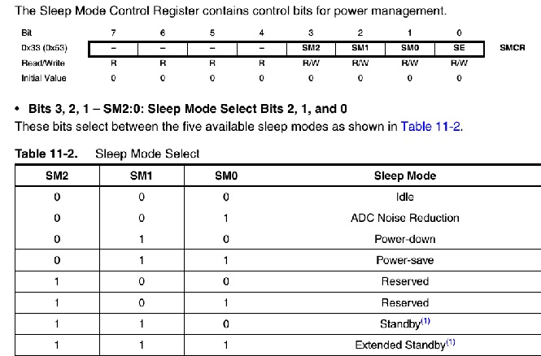
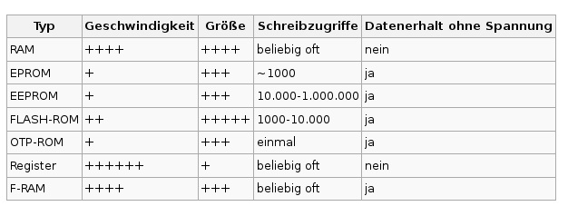
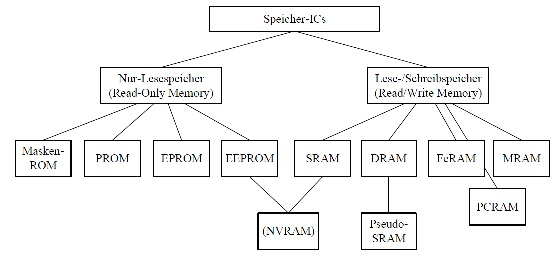
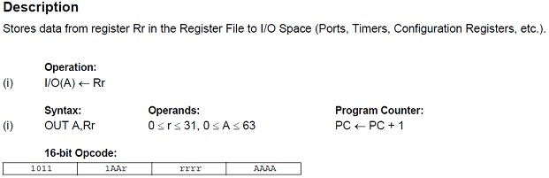
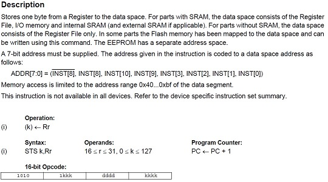
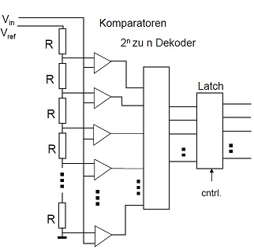
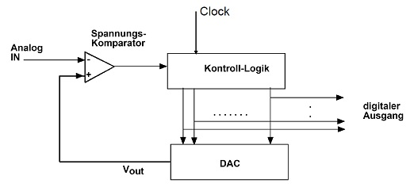
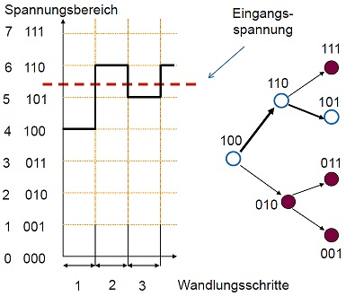

# Theoretisches Aufgabenblatt 1

## Aufgabe 1
**Vergleichen Sie folgende eingebettete Systeme:**
 * Mobiler Serviceroboter
 * Fahrkartenautomat
 * automatischer Türöffner

 **Können alle 3 Systeme als eingebette bezeichnet werden? Stellen Sie dazu Eigenschaften, Komponenten und Anforderungen gegenüber.**

---

## Aufgabe 2
**Was beschreibt die Von-Neumann Architektur und wie unterscheidet sie sich von der Harvard-Architektur?**
* Harvard:        
 * je ein Befehls- und Datenbus
   * Befehle und Daten in getrennten Speichern
 * schneller gleichzeitiger Zugriff auf Code und Daten
 * kommt hauptsächlich in Signalprozessoren und Mikrocontrollern zum Einsatz
 * Komponenten: E/A-Werk; Speicherwerk mit getrennten Speichern für Daten u. Programme; CPU bestehend aus Rechenwerk und Steuerwerk; Datenbus und Befehlsbus.
 * Im CPU kommunizieren Rechen- und Steuerwerk; sonst DS und Rechenwerk über Datenbus und Programmspeicher (CS) mit Steuerwerk über Befehlsbus.
 * Vorteile: Befehle und Daten können gleichzeitig geladen werden – schnell; Trennung von DS und CS sorgt dafür dass bei fehlerhafter Software kein Programmcode überschrieben werden kann
 * Nachteile: Freier Programmspeicher kann nicht für Daten genutzt werden oder umgedreht; selbst-modifizierender Code durch Trennung nicht möglich

* Neumann:
 * nur ein Bus für Befehle und Daten
   * Befehle und Daten in gemeinsamen Speicher „Architektur des minimalen Hardware-Aufwands“ / „Prinzip des minimalen Speicheraufwands“
 * flexible Aufteilung des Speichers zwischen Code und Daten
 * kommt hauptsächlich im allg. Computer vor
 * Komponenten: Eingabe/Ausgabewerk; Speicherwerk mit gemeinsamen Speicher für Daten und Programme; CPU mit Rechenwerk und Steuerwerk
 * Rechen- und Steuerwerk tauschen Daten aus
 * Speicherwerk und CPU tauschen untereinander und mit E/A-Werk Daten aus
 * Problem: v. Neumann-Flaschenhals Verbindungssystem (Daten und Befehlsbus) wird zum Engpass zwischen Prozessor und Speicher

## Pflichtaufgabe A
**Welche Merkmale unterscheiden RISC- und CISC-Rechner? Was war die Intention zu deren Entwicklung? Wo liegen Vor- und Nachteile? Wo ist der AtMega 2560 einzuordnen?**

* RISC (Reduced Instruction Set Computer)
 * weniger Instruktionen
 * elementare Befehle
 * Umsetzung im Steuerwerk fest verdrahtet
 * weniger Addressierungsarten
 * Intention: eine Befehlsabarbeitung in jedem Takt
 * Cons:
   * Anzahl der Instruktionen wächst
   * mehr Speicherplatz für Programme nötig
   * benötigt größere Speicherbandbreite für den (Befehls-)Speicher
  * Pros:
   * Einfachheit ??
   * Preiswerte Herstellung
   * höhete Taktraten
   * Geschwindigkeitsgewinn durch Pipelining & wenige Speicherzugriffe
   * Speicherbandbreite kann durch Cachingtechniken erhöht werden  

* CISC (Complex Instruction Set Computer)
 * weniger Register
 * profitiert mehr von Caching
 * Opcode unterschiedlicher länge
 * komplexere Addressierungsmöglichkeiten
 * Abarbeitung über Mikroprgramm
 * Intention: komplexe Rechenschritte mit einem Maschienenbefehl ausführen
 * Pros:
   * Große Auswahl an Befehlen
   * kürzere Programme
   * flexibel erweiterbar
 * Cons:
   * unterschiedliche Abarbeitungszeiten erschweren den Einsatz von Pipelining   

AtMega = CISC

---

## Aufgabe 3
**Welche Parameter bestimmen die Energieaufnahme eines Mikrocontrollers zur Laufzeit?**
* Wahl des Betriebsmodis:
 * Aktive Clocks
 * Oszillatoren
 * Wake-UpGeräte
 
* Kommunikation von Sensorknoten
 * Lösung: Zeitslots zum Empfangen und Senden von Daten

---

## Aufgabe 4
**Warum hängt die maximale Taktrate von der Eingangsspannung ab?**

---

## Aufgabe 5
**Als Speicherelemente für eingebundene Systeme werden für nicht-flüchtigen Speicher EEPROM und Flash - Elemente benutzt. Nennen Sie Gemeinsamkeiten sowie Vor- und Nachteile der beiden Speichermedien.**

EEPROM - Electrically Erasable Programmable Read Only Memory

---

## Aufgabe 6
**Die Zahl der Schreibvorgänge auf einem EEPROM/Flash ist beschränkt. Erklären Sie diesen Effekt und beschreiben Sie eine Möglichkeit seinen Einfluß auf die Lebensdauer zu reduzieren.**

---

## Aufgabe 7
**Erläutern Sie die die Idee des ”Memory-Mapped-IO“.**

MMIO ist ein Verfahren zur Kommunikation einer Zentraleinheit mit Peripheriegeräten. Die I/O-Register von elektronischen Bauelementen, mit denen angeschlossene Hardware gesteuert wird, werden in den Hauptspeicher-Adressraum abgebildet. Der Zugriff auf die Bauelemente kann dann über übliche Speicherzugriffsroutinen geschehen. Es werden keine besonderen Befehle benötigt wie bei der Realisierung der Ein-/Ausgabe mittels I/O-Ports am Prozessor. Sind die Bauelemente in den Prozessor integriert (Mikrocontroller), ist Memory Mapped I/O der Regelfall. Das Gegenstück ist Port-Mapped I/O oder Isolated I/O – die Register der Bauelemente werden über eigene Portadressen in einem separaten I/O-Adressraum angesprochen.

 * Vorteil: Zugriff über Strukturen und Pointer aus einer Hochsprache wie C oder C++ vollständig auf die Hardware möglich, ohne Teile des Programms in Assembler bzw. Maschinensprache schreiben zu müssen. Homogene Befehle und Adressierungsarten.
 * Nachteil: ein Teil des Adressraums dadurch belegt wird und nicht mehr für echten Hauptspeicher genutzt werden kann. Somit verkleinert sich die maximale nutzbare Speichergröße, was vor allem bei Prozessoren mit kleinen Adressräumen problematisch sein kann.

Heute herrscht immer noch ein Nebeneinander von Memory- und Port-Mapped-Verfahren. Memory-Mapped-I/O ist zwar eine Vereinfachung für die Softwareentwicklung, jedoch problematisch in Bezug auf die Konstruktion – insbesondere bei einem modularen Aufbau der Systeme. Memory-Mapped-I/O wurde daher anfänglich im Wesentlichen bei Systemen mit festem Aufbau verwendet, etwa vielen 8-Bit-Rechnern und dem Commodore Amiga. Die bei Personal Computern dominierenden Intel-Prozessoren bieten zwar auch Port-Mapped I/O an, werden aber trotzdem immer mehr auch in Memory-Mapped-Umgebungen betrieben, um deren Vorteile auszunutzen, was dank der in der 64-Bit-Ära größer gewordenen Adressräume leichter umsetzbar ist.

---

## Pflichtaufgabe B
**Wie sieht der maschinenlesbare (AtMega 2560 spezifische) Opcode für die Befehle out 0x10, r16 und sta 0x20, r16 aus? Erklären Sie die Unterschiede zwischen beiden Befehlen?**

Befehl: out 0x10,r16

* 16-bit Opcode: 1011 1011 0000 0000

Befehl: sts 0x20,r16

* 16-bit Opcode: 1010 1010 0000 0000

---

## Aufgabe 8
**Beschreiben Sie die 3 in der Vorlesung vorgestellten Verfahren zur Analog-Digital- Wandlung und benennen Sie Vor- und Nachteile dieser Ansätze. Welches Verfahren kommt in dem in den Übungen verwendeten Mikrocontroller zum Einsatz?**

 1. ParalleleWandlung-Flash Wandler
  * Vorteil: HoheGeschwindigkeit
  * Nachteil: Hardwareaufwand für höhere Auflösungen

     

     Das analoge Eingangssignal wird im Flash-Umsetzer gleichzeitig von allen Komparatoren mit den (über einen linearen Spannungsteiler erzeugten) Vergleichsgrößen verglichen. Anschließend erfolgt durch eine Kodeumsetzung der $2^n-1$ Komparatorsignale in einen n bit breiten Binärkode (mit n: Auflösung in Bit). Das Resultat steht damit nach den Durchlaufverzögerungen (Schaltzeit der Komparatoren sowie Verzögerung in der Dekodierlogik) sofort zur Verfügung. Im Ergebnis sind die Flash-Umsetzer also sehr schnell, bringen aber im Allgemeinen auch hohe Verlustleistungen und Anschaffungskosten mit sich (insbesondere bei den hohen Auflösungen).

 2. sequentielle Analog/Digital-Wandler: Zählverfahren
  * Vorteil: sehr hohe Auflösungenmöglich; schaltung einfach umsetzbar – kritisches Element DAC/Komperator
  * Nachteil: Variierende Wandlungsdauer langsam

     

     Bei Zählverfahren finden gleichzeitig zwei Dinge statt. Ein analoger durch die Messgröße beeinflusster Prozess, z. B. das stetige Laden eines Kondensators verbunden mit einem Komparator, und ein digitaler Prozess, der Zeiten oder Impulsdichten misst. Es gibt ein Verfahren, bei dem ein Zähler aufwärts oder abwärts allen Änderungen des Eingangssignals folgt, wie weiter unten beim Nachlauf-Umsetzer beschrieben. Die meisten Verfahren bauen die Zählung bei null beginnend in periodischer Wiederholung neu auf.

 3. sequentieller Wandler: sukzessive Approximation/Wägeverfahren
  * Vorteil: GleicheWandlungsdauer

     

     Diese arbeiten mit einem DAU, der einen Vergleichswert U_v jedes Mal neu aufbaut. Das Eingangssignal wird mittels Intervallschachtelung eingegrenzt. Einfache sukzessive Approximation setzt dabei pro Schritt ein Bit um. Ein um Größenordnungen genaueres und schnelleres Umsetzen kann dadurch erreicht werden, dass die Umsetzung redundant erfolgt, indem mit kleinerer Schrittweite umgesetzt wird, als einem Bit entspricht.

