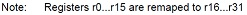

# Theoretisches Aufgabenblatt 1

## Aufgabe 1
**Vergleichen Sie folgende eingebettete Systeme:**
 * Mobiler Serviceroboter
 * Fahrkartenautomat
 * automatischer Türöffner

 **Können alle 3 Systeme als eingebette bezeichnet werden? Stellen Sie dazu Eigenschaften, Komponenten und Anforderungen gegenüber.**

## Aufgabe 2
**Was beschreibt die Von-Neumann Architektur und wie unterscheidet sie sich von der Harvard-Architektur?**

## Pflichtaufgabe A
**Welche Merkmale unterscheiden RISC- und CISC-Rechner? Was war die Intention zu deren Entwicklung? Wo liegen Vor- und Nachteile? Wo ist der AtMega 2560 einzuordnen?**

## Aufgabe 3
**Welche Parameter bestimmen die Energieaufnahme eines Mikrocontrollers zur Laufzeit?**

## Aufgabe 4
**Warum hängt die maximale Taktrate von der Eingangsspannung ab?**

## Aufgabe 5
**Als Speicherelemente für eingebundene Systeme werden für nicht-flüchtigen Speicher EEPROM und Flash - Elemente benutzt. Nennen Sie Gemeinsamkeiten sowie Vor- und Nachteile der beiden Speichermedien.**

## Aufgabe 6
**Die Zahl der Schreibvorgänge auf einem EEPROM/Flash ist beschränkt. Erklären Sie diesen Effekt und beschreiben Sie eine Möglichkeit seinen Einfluß auf die Lebensdauer zu reduzieren.**

## Aufgabe 7
**Erläutern Sie die die Idee des ”Memory-Mapped-IO“.**
MMIO ist ein Verfahren zur Kommunikation einer Zentraleinheit mit Peripheriegeräten. Die I/O-Register von elektronischen Bauelementen, mit denen angeschlossene Hardware gesteuert wird, werden in den Hauptspeicher-Adressraum abgebildet. Der Zugriff auf die Bauelemente kann dann über übliche Speicherzugriffsroutinen geschehen. Es werden keine besonderen Befehle benötigt wie bei der Realisierung der Ein-/Ausgabe mittels I/O-Ports am Prozessor. Sind die Bauelemente in den Prozessor integriert (Mikrocontroller), ist Memory Mapped I/O der Regelfall. Das Gegenstück ist Port-Mapped I/O oder Isolated I/O – die Register der Bauelemente werden über eigene Portadressen in einem separaten I/O-Adressraum angesprochen.

 * Vorteil: Zugriff über Strukturen und Pointer aus einer Hochsprache wie C oder C++ vollständig auf die Hardware möglich, ohne Teile des Programms in Assembler bzw. Maschinensprache schreiben zu müssen.
 * Nachteil: ein Teil des Adressraums dadurch belegt wird und nicht mehr für echten Hauptspeicher genutzt werden kann. Somit verkleinert sich die maximale nutzbare Speichergröße, was vor allem bei Prozessoren mit kleinen Adressräumen problematisch sein kann.

Heute herrscht immer noch ein Nebeneinander von Memory- und Port-Mapped-Verfahren. Memory-Mapped-I/O ist zwar eine Vereinfachung für die Softwareentwicklung, jedoch problematisch in Bezug auf die Konstruktion – insbesondere bei einem modularen Aufbau der Systeme. Memory-Mapped-I/O wurde daher anfänglich im Wesentlichen bei Systemen mit festem Aufbau verwendet, etwa vielen 8-Bit-Rechnern und dem Commodore Amiga. Die bei Personal Computern dominierenden Intel-Prozessoren bieten zwar auch Port-Mapped I/O an, werden aber trotzdem immer mehr auch in Memory-Mapped-Umgebungen betrieben, um deren Vorteile auszunutzen, was dank der in der 64-Bit-Ära größer gewordenen Adressräume leichter umsetzbar ist.

## Pflichtaufgabe B
**Wie sieht der maschinenlesbare (AtMega 2560 spezifische) Opcode für die Befehle out 0x10, r16 und sta 0x20, r16 aus? Erklären Sie die Unterschiede zwischen beiden Befehlen?**

Befehl: out 0x10,r16

* 16-bit Opcode: 1011 1011 0000 0000

Befehl: sts 0x20,r16

* 16-bit Opcode: 1010 1010 0000 0000

---

## Aufgabe 8
**Beschreiben Sie die 3 in der Vorlesung vorgestellten Verfahren zur Analog-Digital- Wandlung und benennen Sie Vor- und Nachteile dieser Ansätze. Welches Verfahren kommt in dem in den Übungen verwendeten Mikrocontroller zum Einsatz?**

