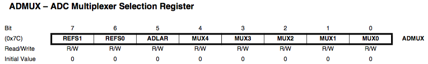
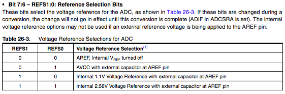
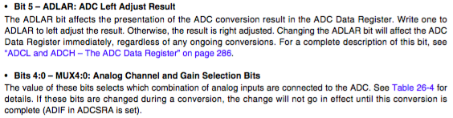
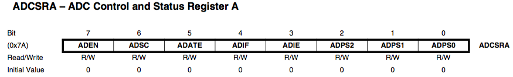
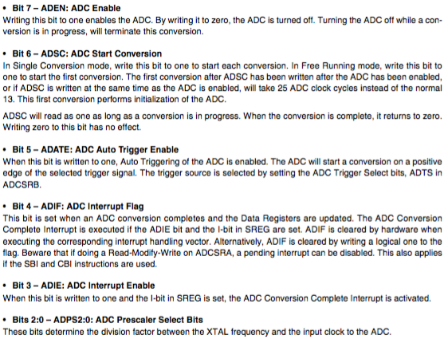
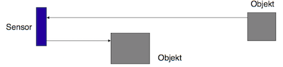
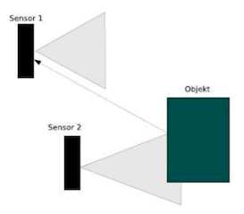
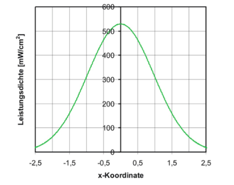
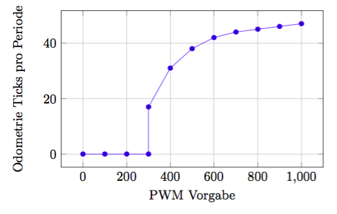

# Theoretisches Aufgabenblatt 2
## 1.
**Ein Mikrocontroller AtMega2560 soll zur Analog-Digital-Wandlung eingesetzt werden. Folgende Eigenschaften sollen dabei gelten**
* **Der Analog/Digital-Converter soll kontinuierlich eine Wandlung durchführen.**
* **Der entsprechende Interrupt soll abgeschaltet sein.**
* **Die Wandlungszeit soll so kurz wie möglich sein.**

**Geben Sie die Konfiguration der Kontrollregister (ADCSRA und ADMUX) an. Die notwendigen Informationen hierzu finden sie auf der Webseite unter Veröffentlichungen und Paper.**





| Bit   |  7  |  6  |  5  |  4  |  3  |  2  |  1  |  0  |
| ----- | --- | --- | --- | --- | --- | --- | --- | --- |
| Value |  0  |  0  |  0  |




| Bit   |  7  |  6  |  5  |  4  |  3  |  2  |  1  |  0  |
| ----- | --- | --- | --- | --- | --- | --- | --- | --- |
| Value |  1  |  1  |  0  |  1  |  0  |  0  |  0  |  0  |

---
## 2.
**Die Interruptroutine in der vorhergehenden Aufgabe soll in einer zeitkritischen Anwendung laufen. Wie würden Sie vorgehen, um die maximale Zeitdauer zu bestimmen, bis ein High-Pegel am Eingangspin mit einem High-Pegel am Ausgangspin quittiert wird.**

---
## 3.
**Sie bereiten einen Roboter für den Einsatz in der Antarktis vor. Bewerten Sie die folgende Sensorauswahl, für Lokalisationsaufgaben/Hindernissdetektion im Hinblick auf die Robustheit, Genauigkeit und Präzision:**

* Ultraschallsensoren
  * Robustheit
    * Probleme mit diffusen Oberflächen
    * Eis/ Schnee auf Ultraschallerzeuger/Membran/Piezo?!
  * Genauigkeit und Präzision
    * cm bis ~10m
    * typisch ca +/-1,5%
* Laserscanner
  * Robustheit
    * nicht temperaturempfindlich
  * Genauigkeit und Präzision
    * sehr genau, angeblich bis zu 1mm
* GPS
  * Robustheit
    * sehr robust
  * Genauigkeit und Präzision
    * 5-20m (Verbesserung durch den Einsatz von WAAS/EGNOS-Korrektursignale --> wahrscheinlich nicht in der Antarktis vorhanden)
    * abhängig von der Signalstärke(Bewölkung) / mehr von Satelittenanzahl
    * geeignet zur groben Orientierung
    * wenige Satelliten in Sichtweite
* Kompasssensoren
  * Robustheit
    * sehr robust - in Gehäuse geschützt
  * Genauigkeit und Präzision
    * ungeeignet auf Grund des magnetischen Feldes der Erde
* automotive Radarsysteme
  * Robustheit
    * unabhängig von äußeren Einflüssen
  * Genauigkeit und Präzision
    * sehr zuverlässlich und genau
    * Messung von Entfernung und relativer Geschwindigkeit
    * Entfernungen bis 250m

---
## A
**Welche Umgebungsdaten stellt die in der Übung verwendet IMU bereit? Wie kann auf der Basis von deren Messungen die Position/Positionsänderung des Roboters bestimmt werden?**

* Umgebungsdaten:
 * Gyroscope (Lagedaten)
 * Accelerometer (Beschleunigungssensor)
 * Magnetometer (Messung magnetischer Flussdichten)


 Integration der Bewegungsbeschleunigung, dazu muss aber Erdbeschleunigung rausgerechnet werden - (Dazu Gyro zur Horrizontbestimmung) und sonst bestimmt "noch viel schwarze Magie"

---
## 4.
**Was ist der Unterschied zwischen Inkremental- und Absolutdrehgebern. Benennen Sie jeweils ein Einsatzbeispiel.**

* Beim Absolutwertgeber erfolgt die Erfassung über eine Kodierscheibe. Mehrere Umdrehungen werden durch ein eingebautes Getriebe oder andere Verfahren (z.B. Wiegand-Draht) erkannt, es folgt die serielle Übertragung der Messwerte zum Auswertegerät. Der Messwert steht sofort nach dem Einschalten zur Verfügung.
 * Positionieraufgaben
 * Zählaufgaben
* Inkrementalgeber liefern eine bestimmte Anzahl an Impulsen pro Umdrehung sowie einen sogenannten Nullimpuls pro Umdrehung. Hier findet die Erfassung über eine Strichscheibe, Magnetrad (Polrad) oder Zahnradflanken statt.
 * Typische Einsatzgebiete sind die Positionsbestimmung in der Automatisierungstechnik sowie Bedienungselemente von elektronischen Geräten
 * Tintenstrahldruckern messen die Position des Druckwagens
 * Bewegungen der Rollkugel in optomechanischen Computermäusen

---
## 5.
**Für die Zusammenfassung von Messwerten und zur Merkmalsextraktion unterscheidet man zwischen der komplementären, konkurierenden und kooperativen Fusion. Beschreiben Sie die Verfahren unter Benennung eines Einsatzszenarios.**

* **komplementäre Fusion**
  * Vollständigkeit der Daten erhöhen durch unabhängige *Sensoren die untersch. Bereiche/Zeiten* messen

* **konkurierende Fusion**
  * Sensoren messen gleichen Bereich und liefern Ergebnisse gleicher Art. *Genauigkeit wird durch (gewichtete) Verknüpfung erhöht*

* **kooperative Fusion**
  * gewünschte Information erst *durch Zusammensetzen verschiedener Ausgabedaten*

=======

* konkurrierenden Fusion – Redundante Erfassung des selben Sichtbereiches
* komplementäre Fusion – Unabhängige Erfassung verschiedener Ausschnitte der Umgebung
* kooperative Fusion - Kombination verschiedener Modalitäten


---
## B
**Was versteht man unter Modalität von Sensoren? Geben Sie Modalitäten an, die in Distanzsensoren verwendet werden. Warum werden unterschiedliche Modalitätsformen in einer Anwendung kombiniert?**

```
 Eine Modalität bezeichnet ein kommunikatives System, das durch die Art und Weise wie Information kodiert und interpretiert wird, gekennzeichnet ist.
```
(oder: **nach physikalischer Messgröße (Modalität)**)
* in Distanzsensoren werden die Modalitäten von Ultraschall, Laserlicht, taktil, Kapazität verwendet
* Eine Kombination ist wichtig da jede Modalität bestimmte Eigenschaft hat.
  * Reichweite: Ein Sensor mit taktiler Modalität kann meist nur noch als letzter Stopper eingesetzt werden. Ultraschallsensoren dagegen wehmen das nähere Umwelt war.
* Die Kombination der Sensoren ergibt eine verbesserte Übersicht über das Umfeld.

---
## 6.
**Recherchieren Sie das Phänomen des ”cross talk“ bei Ultraschallsensoren und Maßnahmen zur Korrektur.**

* eine Welle kann auf mehreren Objekten reflektiert werden, bevor sie als Echo vom Sensor empfangen wird

 * Verwendung mehrerer Sensoren mit genügend Abstand zur Unterscheidbarkeit von Objekten

* bei gleichzeitigem Betrieb von mehreren Ultraschallsensoren kann ein Sensor das Echo einer Welle empfangen, die von einem anderen Sensor gesendet wurde

 * Eine Möglichkeit bei Robotern mit mehreren Ultraschallsensoren ist, die Sensoren einen nach dem anderen zu aktivieren, was jedoch die allgemeine Auffrischungsrate verringert.

---
## 7.
**In der Vorlesung wird ein Experiment der Universität des Saarlandes vorgestellt, dass die Möglichkeiten der laserbasierten Lichtübertragung untersucht. Abbildung 1 zeigt die Abhängigkeit der Leistungsdichte vom horizontalen Auftreffpunkt des Laserlichtes.**


Abbildung 1: Leistungsausbeute der Photozelle in Abhängigkeit zur horizontalen Ausrichtung des Lasers [Uni Saarland]

**Welcher maximale Winkelfehler ist für die auf der Vorlesungsfolie genannten Entfernungen [35m, 55m, 130m, 230m] zulässig, wenn sichergestellt werden soll, dass die Leistungsdichte nicht unter die Hälfte des Maximalwertes fällt.**

$P_{max}=540$

$P_{halb}=270 -> x \pm 1.2 cm$

$arctan(1.2/3500) = 0.019..$°

$arctan(1.2/5500) = 0.0115..$°

$arctan(1.2/13000) = 0.0052..$°

$arctan(1.2/23000) = 0.0029..$°

-> Scheisse kleiner Winkelfehler nur erlaubt

---
## 8.
**In Abbildung 2 sehen Sie die experimentell ermittelte Kennlinie des an unseren Robotern eingesetzten Elektromotors.**



Abbildung 2: Kennlinie eines Roboterantriebes

a) **Wie kommt nach Ihrer Auffassung das nicht-lineare Verhalten zustande?**

Reibung

b) **Welches Verhalten ist für eine PWM Vorgabe kleiner als 300 zu beobachten?**

Brummen, sonst nichts


c) **Entwerfen Sie konzeptionell eine Funktion, die die Kennlinie linearisiert.**
Lookup Table oder annäherung durch drei Geraden
