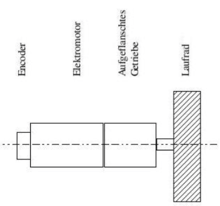
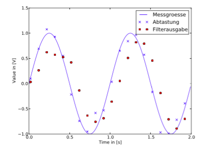
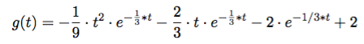
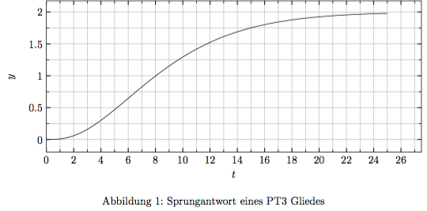

# Theoretisches Aufgabenblatt 3
## A
**Welche Timermodi gibt es beim AVR ATmega2560, erläutern sie kurz die Prinzipien, Unterschiede und Einsatzgebiete.**

 * Internal oder External Clock
(Abtasttheorem, max. 1/2 Prozessortakt!)
 * 8bit, 16bit Counter
 * über Prescaler Count bei jedem/ jedem 8 .... möglich

 * Modes:
  * normal Mode
    * wird hochgezählt
    * Flag bei Überlauf
    * Interrupt bei Überlauf oder Compare Unit möglich
  * (CTC) Clear Timer on Compare Match
    * zählt hoch, clear bei Match
  * Fast PWM
    * zählt hoch, 1 bei Match, 0 bei Überlauf
    * (bis zu) doppelt so schnell wie Phase Correct PWM
  * Phase Correct PWM
    * wie fast PWM, zählt aber hoch und runter
    * niedrigere Maximalfrequenz als Fast PWM

---
## B (ATmega 2560)
```
#include <avr/io.h>
#include <avr/interrupt.h>

volatile int counter=0;

ISR(INT0_vect){
  counter++;
  if (counter%10) PORTD &= ̃ 2;
  else PORTD |= 2;

}
void main{
  DDRD |= (1<<DDD0); //IN
  DDRD &= ̃(1<<DDD1); //OUT
  EIMSK = (1<<INT0);
  EICRA = (1<<ISC01 | 1<<ISC00);
  while (1){
    // do something
  }
}
```
  * **Welcher Interrupttyp wird mit der oben skizzierten Methode bedient? An welcher Stelle steht er in der Interruptvektortabelle?**

    External Interrupt (an Stelle 2 in der Tabelle ``` dollar0002 ```),

  * **Könnte dieser Interrupt von einem anderen Interrupt unterbrochen werden?**

  ja, nur vom Reset Interrupts

  (Laut Vektortabelle höherwertig)

  * **Das Programmfragment ist unvollständig und würde die intendierte Funktion nicht umsetzen. Was fehlt?**

  Interrupts nicht eingeschaltet?
  angeblich: SREG auf stelle i


---
## 1.
**Bestimmen Sie aus den folgenden Register-Einstellungen für den AtMega2560 das Tastverhältnis und die Frequenz des PWM-Signals. Stellen Sie die Entwicklung des Counter- Wertes und des Ausgangspins über der Zeit dar. Der Systemtakt beträgt 16 Mhz. Der Controller wurde unmittelbar vor der Ausführung des folgenden Codes resetet.**
```
pinMode(13, OUTPUT);
TCCR0A = BV (COM0A1) | BV (WGM1) | BV (WGM0) ; TCCR0B = BV(CS02) | BV(CS00);
OCR0A = 180;
```

```
pinMode(11, OUTPUT);
TCCR1A = BV(COM1A1) | BV(WGM11) | BV(WGM10); TCCR1B = BV(CS12);
OCR1AH = 3;
OCR1AL = 0;
```

---
## 2.
**Welche Funktion hat das volatile im vorangegangenen Codefragment?**
Laut [wikipedia](https://de.wikipedia.org/wiki/Volatile_(Informatik)):
* ``volatil`` ist Typqualifikator
* Wert kann sich jederzeit ändern (andere Prozesse, Threads, ext. Hardware im PC) -> AVR durch Interupt!
* Compiler verzichtet auf Funktion beeinschränkende Optimierung

"Das Counterwert beim Interrupt nicht verloren geht"

---
## 3.
**Gegeben sei die in der folgenden Abbildung gezeigte Antriebseinheit eines mobilen Ro- boters.**

*Die für die Odometrie wichtigen Paramter sind dabei:
* A Auflösung des Inkrementalgebers
* i Übersetzung $n_{gear}/n_{motor}$
* D nomineller Raddurchmesser*

**Leiten Sie aus dem gegeben Schema den Faktor $k_c$ her, der Verhältnis zwischen zurückgelegtem Weg $\Delta s$ und der resultierenden Zahl der Odometrieimpulse n bestimmt.**

$k_c = \frac{\Delta s}{n} =$

für eine Umdrehung des Rades:
$$\Delta s = 2* \pi * r = D * \pi$$
für eine Umdrehung des Motors:
$$n = A$$
Übertragungsverhältnis i:
$$ i = n_{Rad} / n_{Motor}$$

$k_c = \frac{D * \pi * i}{A}$

---
## 4.
**Bei einem sogenannten differenziellen Aufbau, den Sie vom Roboter aus den U ̈bungen kennen, sind zwei der oben genannten Antriebseinheiten entgegengesetzt auf einer Line angeordnet. Der Abstand b zwischen den Aufstandsfla ̈chen der Ra ̈der betra ̈gt 14,5 cm. Daneben gilt D = 5cm, A = 120 und i = 1/20. Es werden am linken Rad 2300 und am rechten 3900 Ticks geza ̈hlt.
Wie hat sich die Position des Roboters (∆x, ∆y) und seine Orientierung ∆θ vera ̈ndert?**

Strecke linkes Rad:
$d_L = 230/12 * 1/20 * \pi * 5cm \approx 15.05 cm$

rechtes Rad
$d_R = 32.5 * 1/20 * \pi * 5cm \approx 25.53 cm$

Radius $r$ von Kurvenmittelpunkt zum linken Rad

I) $\frac\theta{360} 2 \pi r = 15.05cm$

II) $\frac\theta{360} 2 \pi (r+14.5cm) = 25.53cm$

I) in II) eingesetzt und aufgelöst:

$\Rightarrow  r=\frac{15.05 * 14.5}{25.53 - 15.05} cm \approx 21.23 cm$

r wieder in I):

$\Rightarrow \Delta \theta \approx 40.62$°

$$s = 19.944$$

$\beta = 90-\frac{180-\theta}{2} = 20.31$

$\Delta x = sin(\beta) * s = 19,92cm$
-> sollte 18.5 sein

$\Delta x = cos(\beta) * s = 0,79 cm$
-> soll 7 sein.

Ergebnis nicht plausibel müssten ca. gleich sein bei 40 GRad eines Kreises!!!

---
## 5.
**Die den Sensorsystemen zur Umgebungswahrnehmung nachgeordneten Strukturen zur Entscheidungsfindung lassen sich in zwei grundsätzliche Entwürfe - die Weltmodellidee und den verhaltensbasierten Ansatz - unterteilen. Recherchieren Sie beide Systeme und vergleichen Sie diese anhand von Beispielen.**

Weltmodell:
 * Speichermodell des bisher gemessenen Raumes.
 * Plane anhand des Modells den Weg


verhaltensbasierter Ansatz:
 * keine Ahnung von Umgebung. Handelt reaktiv
 (wenn er anstößt)

---
## 6.
**Sie betreuen einen Fachinformatiker im ersten Lehrjahr. Er hat in Ihrem Auftrag einen Messwerterfassung und einen gleitenden Mittelwertfilter (y = 1/3 · (xn + xn−1 + xn−2 )) entworfen. Stolz erklärt er, das Nyqist-Theorem berücksichtigt zu haben, trotzdem sehe das Ergebnis ”komisch“ aus. Helfen Sie Ihm.**


---
## 7.
**Sie wollen aus den Messdaten eines GP2Dxxx Entfernungssensors Ausreißer herausfiltern und die Daten glätten. Welche Methoden könnten zum Einsatz kommen und wie lassen sich diese auf eingebetteten Systemen ohne ALU effektiv umsetzen?**


  oder elektronisch glätten: Kondensator! (= Tiefpassfilter)
  durchschnitt
  Medianfilter

  ohne ALU:
  kein Float!
  Durchschnitt bilden nicht möglich

  vll in Array sortieren und mittleres Element nehmen (heißt das Medianfilter) Vergleichsoperator nicht in ALU

---
## 8.
**Ermitteln Sie für die folgende Strecke die Einstellparameter eines P-Reglers nach dem Verfahren von Ziegler-Nichols. Dabei können Sie grafisch oder analytisch vorgehen.**

**Die Sprungantwort des in der folgenden Abbildung dargestellten Systems entspricht einem $PT_3-Glied$ und lässt mit der Gleichung**

**beschreiben.**

