# Theoretisches Aufgabenblatt 4
## A
*Welche Eigenschaften sind von besonderer Bedeutung bei der Auswahl eines Scheduling- Verfahrens für eingebettete Systeme im Vergleich zu General-Purpose Systemen?*

---
## 1.
*Welche Eigenschaften bestimmen die Wahl des Scheduling-Algorithmus*

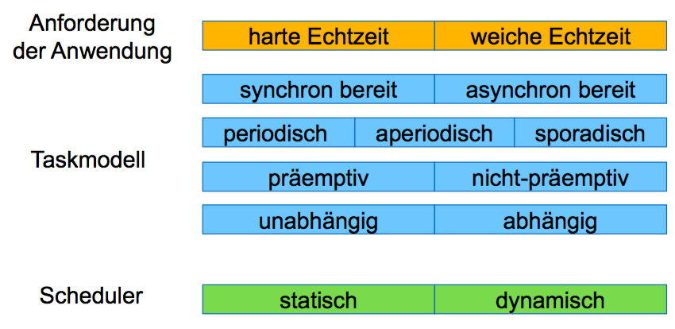

---
## 2.
*Was versteht man unter weicher und harter Echtzeitfähigkeit? Benennen Sie jeweils ein Anwendungsbeispiel.*

* Echtzeitbetrieb nach DIN 44300 ... Ein Betrieb eines Rechensystems,
bei dem Programme zur Verarbeitung anfallender Daten ständig betriebsbereit sind, derart, dass die Verarbeitungsergebnisse innerhalb einer vorgegebenen Zeitspanne verfügbar sind. Die Daten können je nach Anwendungsfall nach einer zeitlich zufälligen Verteilung oder zu vorherbestimmten Zeitpunkten anfallen.

* Harte Echtzeit (Rechtzeitigkeit - timeliness)
= die Abarbeitung einer Anwendung wird innerhalb eines bestimmten Zeithorizontes umgesetzt
$$A=r+\Delta e\leq d$$
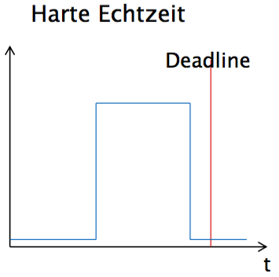
  * Beispiel: Notfall-Bremsassistent

* Weiche Echtzeit
= es genügt, die Zeitbedingungen für den überwiegenden Teil der Fälle zu erfüllen, geringfügige Überschreitungen der Zeitbedingungen sind erlaubt
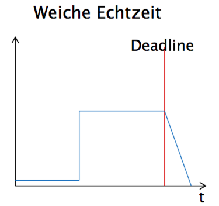
  * Beispiel: Bedingung Klimaanlage

---
## B
*Definieren sie den Begriff des optimalen Schedulers und nennen Sie die Kriterien einer Planbarkeit (Feasibility).*

---
## 3.
*Ist die folgende Menge von Tasks für einen nicht unterbrechenden Scheduler planbar? Warum?*

| $T_i$ | $\Delta e_i$ | $r_i$ | $d_i$ |
| :---: | :----------: | :---: | :---: |
|   1   |      3       |   2   |   6   |
|   2   |      6       |   0   |   10  |
|   3   |      4       |   10  |   15  |

Wegen ununterbrechbarer Tasks erfolgt die Umsetzung mittels EDD.
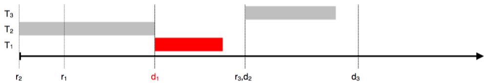
Die Menge an Tasks sind bei nicht unterbrechbaren Scheduler nicht planbar. $T_2$ startet und endet erst bei t=6. Somit ist die deadline für $T_1$ bereits überschritten.

---
## 4.
*Gegeben seien 3 eingebettete Systeme, welche Eigenschaft sollte der verwendete Scheduling Algorithmus aufweisen um einen optimalen Systembetrieb zu gewährleisten:*
* *eine Motorsteuereinheit eines Fahrzeugs(ECU)*
* *eine aktuelle Spielekonsole (z.B.: Playstation 4 oder Xbox One)*
* *ein Satelliten-Bus (Zentraleinheit eines Satelliten, der alle Komponenten verbindet)*

---
## 5.
*Bestimmen Sie für die nachfolgenden, nicht unterbrechbaren Tasks einen Plan. Welche(s) Verfahren sind (ist) anwendbar und welche Komplexität weisen diese auf?*

| $T_i$ | $\Delta e_i$ | $d_i$ |
| :---: | :----------: | :---: |
|   1   |      4       |   9   |
|   2   |      5       |   16  |
|   3   |      2       |   5   |
|   4   |      3       |   10  |

Verwendung von EDD
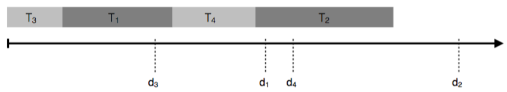

---
## 6.
*Für folgende unterbrechbaren Tasks ist ein Plan zu entwickeln. Nach welchem Verfahren kann dies geschehen?*

| $T_i$ | $\Delta e_i$ | $r_i$ | $d_i$ |
| :---: | :----------: | :---: | :---: |
|   1   |      3       |   5   |   9   |
|   2   |      4       |   3   |   10  |
|   3   |      5       |   0   |   12  |
|   4   |      6       |   0   |   18  |

* EDF
* RMS
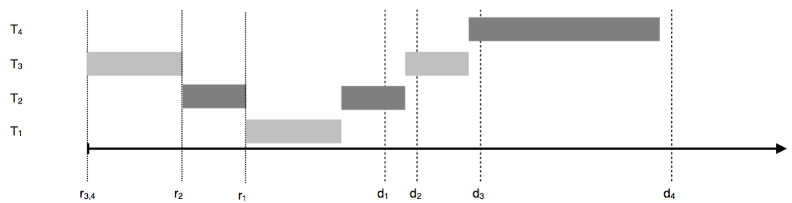

---
## 7.
*Erläutern Sie das periodische Scheduling nach Rate-Monotonic. Entwerfen Sie für folgende Tasks damit einen gültigen Schedule.*

| $T_i$ | $p$   | $\Delta e$ | $rms(i)$ |
| :---: | :---: | :--------: | :------: |
|   1   |   6   |     1      | $\frac{3}{18}$ |
|   2   |   9   |     2      | $\frac{2}{18}$ |
|   3   |   3   |     1      | $\frac{6}{18}$ |

*Wie groß ist die Auslastung des Prozessors durch die drei Tasks?*

Rate Monotonic Scheduling (RMS) ist ein Prioritätsscheduling-Verfahren für unterbrechbare, periodische Jobs und wird häufig in Echtzeitsystemen eingesetzt. Die Prioritäten werden statisch anhand Periodendauer eines Jobs festgelegt: je kürzer die Periodendauer eines Jobs, desto höher ist seine Priorität.
[Quelle](https://de.wikipedia.org/wiki/Rate_Monotonic_Scheduling)

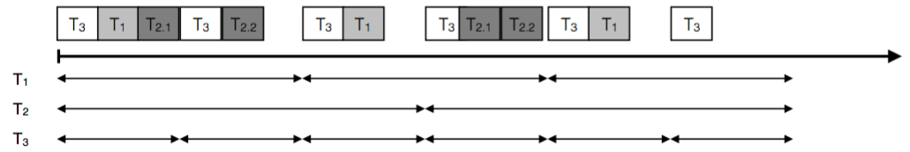

Auslastung:
$$u= \sum_{i=1}^{n} \frac{\Delta e_i}{\Delta p_i}$$
$$u=\frac{3}{18}+\frac{2}{18}+\frac{6}{18}=\frac{11}{18}\approx0,61$$

---
# 8.
*In der Vorlesung wurde ein einfaches C-Programm vorgestellt, dass die Ausführung eines Schedules in einer Super-Loop übernimmt. Entwickeln sie ein Programm das den in der vorangehenden Aufgabe ermittelten Schedule damit umsetzt.*

---

---
## Abkürzungen:
### EDD: Earliest Due Date (Jackson, 1955)
* Jeder Algorithmus, der die Tasks in der Reihenfolge nicht abnehmender Deadlines ausführt, ist optimal bzgl. der Minimierung der maximalen Verspätung.
* Scheduling auf einem Prozessor. Alle n Tasks sind unabhängig
voneinander und können zur gleichen Zeit begonnen werden (zum Zeitpunkt 0).
* EDD generiert bei nicht unterbrechbaren Tasks einen Schedule der optimal im Hinblick auf maximale Verspätung ist.
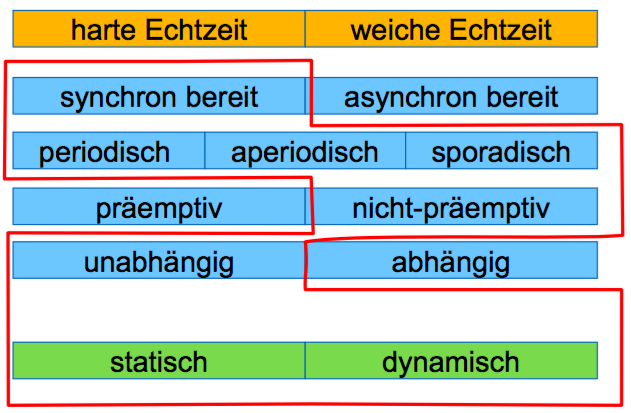

### EDF: Earliest Deadline First
* Wenn eine Menge von n Tasks mit beliebigen Ankunftszeiten gegeben ist, so ist ein Algorithmus, der zu jedem Zeitpunkt diejenige ausführungsbereite Task mit der frühesten absoluten Deadline ausführt, optimal in Bezug auf die Minimierung der maximalen Verspätung.
* EDF ist dabei sehr flexibel, denn es kann sowohl für präemptives, wie auch für kooperatives Multitasking verwendet werden.
* Es können Pläne für aperiodischen sowie periodischen Task
entwickelt werden.
* EDF kann den Prozessor bis zur maximalen Prozessorauslastung einplanen.
• EDF ist ein optimaler Algorithmus.
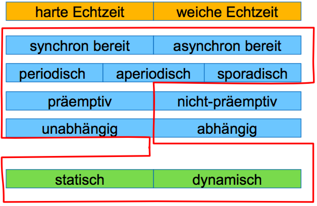

### Least Laxity
* Schedulingvariante mit veränderlicher Priorität
* Spielraum der Task (Deadline-noch benötigte Rechenzeit) wird mit jedem Schritt neu bestimmt
* ebenfalls optimal im Hinblick auf die Minimierung der Maximalen Verspätung

### LDF: Latest Deadline First
* Aus der Menge der Tasks deren Nachfolger bereits alle ausgewählt wurden oder die keinen Nachfolger besitzen, wählt LDF die Task mit der spätesten Deadline aus. Die Warteschlange der Tasks wird also in der Reihenfolge der zuletzt auszuführenden Tasks aufgebaut.
* LDF ist ein optimaler Scheduler

### EDF*: EDF mit Berücksichtigung der Vorrangrelation
* Idee: Umwandlung einer Menge abhängiger Tasks in eine Menge unabhängiger Tasks durch Modifikation der Bereitzeiten und der Deadlines.
* Algorithmus:
 1. Modifikation der Bereitzeiten
 2. Modifikation der Deadlines
 3. Schedule nach EDF erstellen

### RMS: Rate Monotonic Scheduling
* Definition
  * Rate einer periodischen Task = Anzahl der Perioden im Beobachtungszeitraum = Frequenz (über unbegrenzte Zeitraum)
* Für alle Ausführungszeiten und Periodenverhältnisse von n Tasks wird unter RMS ein gültiger Plan gefunden, wenn die Auslastung die Schranke von $n(\sqrt[n]{2}-1)$ nicht übersteigt.

 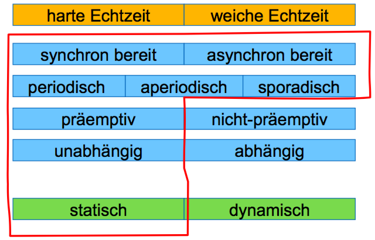

### Parameter einer Task
* T ...Tasktyp (Abfragen des Temperaturfühlers)
* $T_i$ ... i-te Instanz des Tasktyp (Taskobjekt)
* $T_j$ ... j-te Ausführung des Taskobjektes $T_i$

| Abkürzung | Beschreibung |
| --------- | ------------ |
| $T_i$     | Instanz i der Task T |
| $r_i$     | Bereitzeit (ready time) |
| $\Delta e_i$ | Ausführungszeit (execution time) |
| $s_i$     | Startzeit (starting time) |
| $c_i$     | Abschlußzeit (completion time) |
| $d_i$     | Frist (deadline) |
| $\Delta p_i$ | Periode |
| $\Delta j_i$ | Zeitspanne zwischen zwei Startzeiten (Jitter)

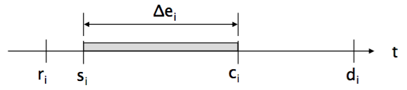

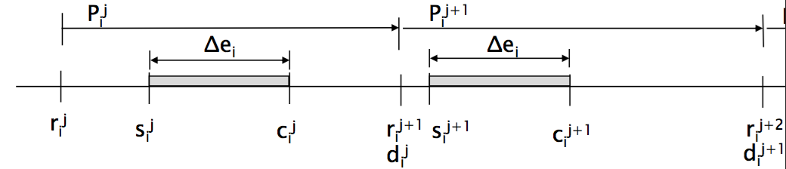
